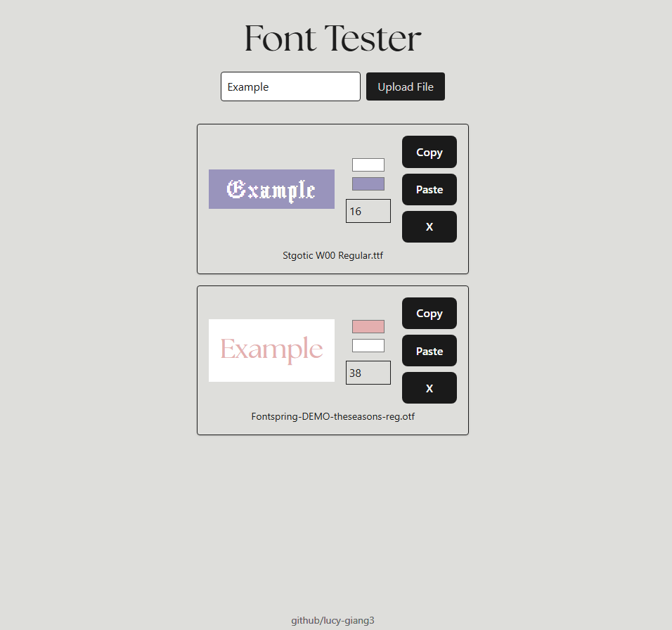

# Font Tester
This is an interactive web tool designed to help users explore and preview various fonts side-by-side before integrating them into your project. Check it out here: https://lucy-giang3.github.io/font-tester/

## Features
- Upload your own fonts (.ttf,.otf,.woff,.woff2)
- Adjustable Parameters: font size, color, background color
- Real-time Rendering: view your preview text in real-time without needing to refresh the page

## Tech Stack
- React
- TypeScript
- TailwindCSS
- HTML5

